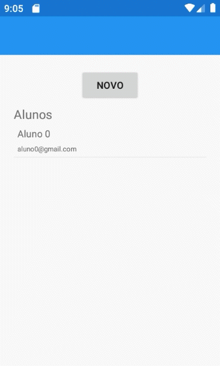

# Trabalho Prático 4 
## Autores: Sandyara Peres e Bruno Fernandes  
Trabalho realizado para a disciplina de programação para dispositivos móveis, ministrada por Wellington Tuller Moraes no Instituto Federal de São Paulo, campus Cubatão.  

### Captura de tela da aplicação
 
